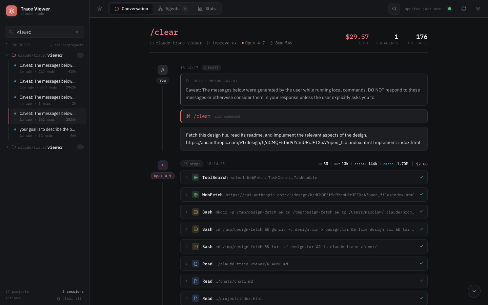
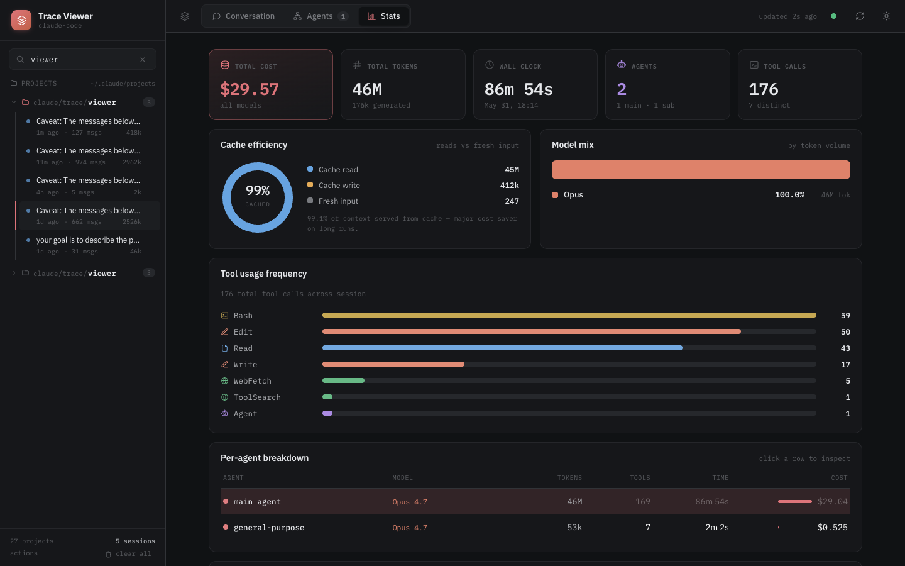
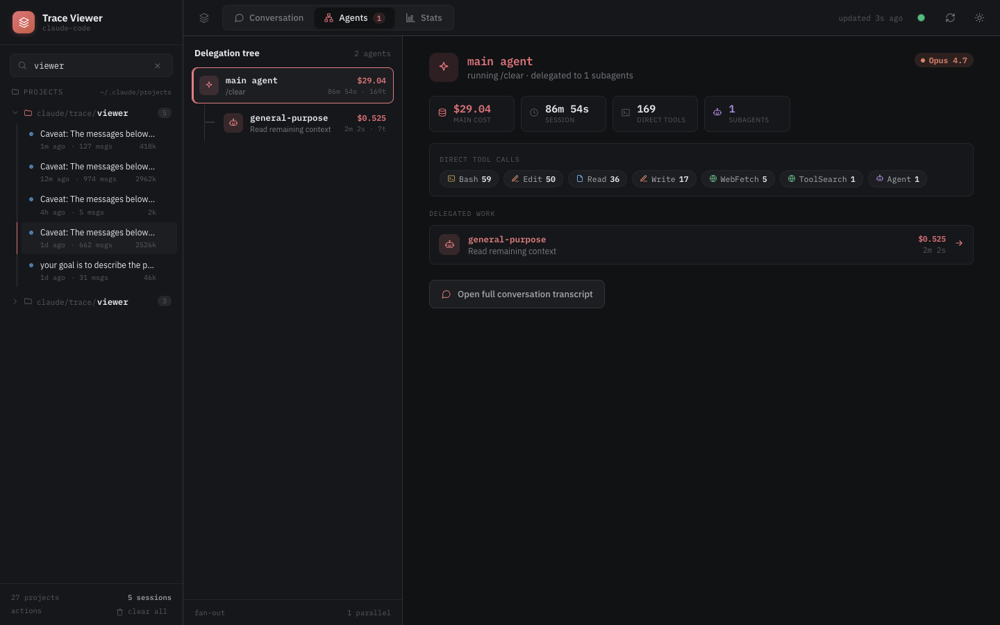

# Claude Trace Viewer

A local viewer for Claude Code sessions. Browses the `.jsonl` trace files Claude Code writes under `~/.claude/` and renders them as readable conversations.

Useful when developing custom subagents and skills: the delegation tree, per-agent transcripts, prompts, tool calls, and per-agent token spend are all visible side by side.



## What it shows

- The full transcript of a session: user messages, assistant turns, thinking blocks, tool calls, and tool results.
- A sidebar listing every project and session found on disk.
- Live sessions, refreshed every 5 seconds.
- In-conversation search.
- Light and dark themes.

## Stats per session



Total cost, token volume, wall-clock duration, agent count, tool calls, cache hit rate, model mix, and a per-agent cost breakdown.

## Subagent delegation



If the session used subagents, the delegation tree is shown with each agent's prompt, model, tool calls, duration, and cost. Click a row to open that agent's transcript.

## Run

```bash
npm install
npm run dev
```

Then open [http://localhost:5173](http://localhost:5173).

Single-port production build:

```bash
npm run build
npm start                  # http://localhost:3099
```

Docker:

```bash
docker compose up          # http://localhost:3099 — mounts ~/.claude read-only
```

Sessions are read from `~/.claude` by default. Override with the `CLAUDE_DIR` environment variable.

## Cost numbers

Costs are **notional**: every session is priced as if the tokens were billed at the public Anthropic API rates, regardless of how you actually pay. If you're on a Claude Pro/Max subscription, no money was charged per token — the figure shown is what the same usage would have cost on the metered API, which is a useful proxy for comparing sessions, agents, and runs against each other.

Rates come from a bundled snapshot covering Opus, Sonnet, and Haiku 3 → 4.x. Bedrock and Vertex routing are not modeled.
